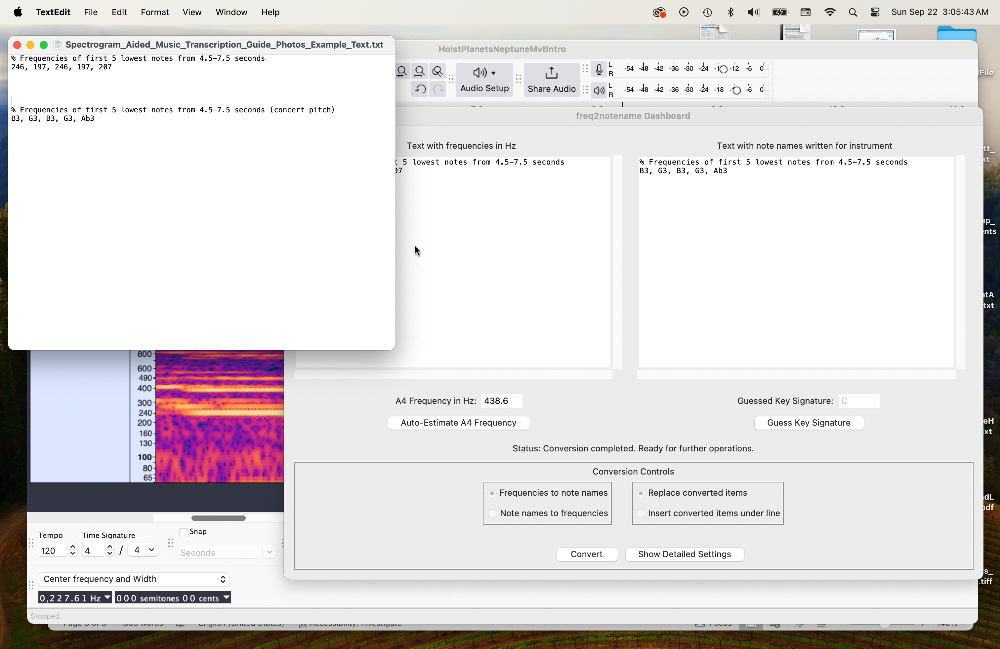

# Spectrogram-aided music transcription: how to turn audio recordings into sheet music without perfect pitch

Zachary Markow

Last Updated 22 September 2024

## Introduction
This document explains how to use spectrograms, Audacity, and freq2notename’s dashboard ([https://github.com/zemarkow/freq2notename](https://github.com/zemarkow/freq2notename)) to help transcribe audio recordings into sheet music.  This technique and document mostly help obtain the correct pitches of notes in the recordings and leave the user/transcriber to tap/figure out the rhythms by ear.  First I explain related necessary concepts and then describe the process; please feel free to skip any material that you already know.

## What is an audio spectrogram?
It's basically a special way of visualizing a sound wave/audio track.  It shows you the strengths of different pitches/frequencies that you hear at different times in the audio track.  Bright/hot spots ("peaks") appear at the pitches/frequencies and time points where the sound is loudest.  This is much like a sheet music staff, where time moves forward as you move from left to right, pitch increases as you move from below to above, and notes/dots appear where they should be played; horizontal position indicates when to play the note, and vertical position indicates how high the note's pitch is.

## How can a spectrogram help me convert an audio track into sheet music?
Every musical note has a specific frequency.\*  When an instrument plays a note, we hear sound mainly at that frequency and also more weakly at integer multiples (2, 3, 4, etc.) times that frequency called harmonics above the note.  This means that when an instrument plays a note, we will see bright/hot spots in the audio spectrogram at that time and at that note's corresponding frequency and harmonics.  If you click+drag to highlight a bright/hot spot on a spectrogram in Audacity, you can closely estimate the frequency of the spot, then type/write that number down somewhere, and then repeat that process for each spot of interest (e.g., the high notes in a melody).  Then you can convert that list of frequencies into the corresponding musical notes with a program like freq2notename’s dashboard.

## \*Wait; a note's frequency changes depending on what reference frequency the instrument(s) are tuned to, whether they are playing in tune, etc.  How can you account for that?
freq2notename can estimate the effective A4 tuning note frequency, even if different from 440 Hz.  The program does this by figuring out what A4 frequency minimizes the cents deviations between each frequency in your list and what the nearest note would be, under different guesses of the A4 frequency.  This way, the program can automatically handle situations where everyone was playing sharper or flatter than A4 = 440 Hz.  If you provide a list of your peaks' frequencies, click "Auto-Estimate A4 Frequency", and freq2notename’s dashboard says A4 = 450 Hz, then people were tuned sharp or playing sharp, and the program will adjust accordingly so note names are not reported 1/2 step too high, for example.  You can also manually specify the A4 tuning note frequency if desired.

## How can I tell which hot spots/peaks are "real" notes vs. harmonics?  How can I tell which peaks correspond to which instrument?
This all takes practice and can be difficult when many instruments are playing simultaneously.  Write out and play back your transcription excerpts in a sheet music typesetting program like MuseScore 4, Sibelius, or Finale to check for accuracy.  Replay the recording's segment while watching the cursor move over the peaks in Audacity to help identify which instrument is creating which peaks if different instruments are playing different rhythms.  Sometimes harmonic peaks are easier to see, which will lead you to write down the harmonic frequencies instead of the main note frequencies.  In that case, try dividing those suspected harmonic frequencies by 2 or 3 (same as dropping an octave or an octave+fifth, respectively) if your transcriptions sound much too high when you play them back in your music typesetting program.  Also note that clarinets only produce "odd harmonics" (3, 5, 7, etc. times the base note's frequency), and "un-pitched" percussion instruments like cymbals typically add some brightness/power spread out over a wide range of frequencies, not just harmonics/integer multiples (much like how white light is really a mixture of all colors in the rainbow).

## Steps for Spectrogram-Aided Music Transcription

1. Download and install the programs Audacity ([https://www.audacityteam.org/](https://www.audacityteam.org/)) and freq2notename ([https://github.com/zemarkow/freq2notename](https://github.com/zemarkow/freq2notename)).  Depending on your computer, you might also need to download the current version of Python ([https://www.python.org/](https://www.python.org/)) to run freq2notename.

2. Open your sound file in Audacity.  Audacity supports many sound file formats, including MP3 and WAV.  However, if you only have the file in a format that you can listen to with other programs, you could convert the file to MP3 with some other program or record the sound directly into a new Audacity file.\*\*

3. Go up to the View menu \> Toolbars sub-menu and turn on the Spectral Selection Toolbar, which will then appear at the bottom of Audacity.

4. Click on the lower edge of the sound waveform and drag downward to expand the view.

5. Right-click to the left of your sound waveform’s view, and switch to the spectrogram view.

6. Right-click in the same location, click "Spectrogram Settings...", and then set the spectrogram's view scale to mel or logarithmic (both work well) from 60 Hz to 2500 Hz.  These two numbers define the range of pitches to zoom in on, so shifted and narrower ranges might be better when you are focusing on only low voices or only high voices.  When choosing this range, it helps to remember that typically A4 is 440 Hz, and you divide or multiply any frequency by 2 to go down or up an octave, respectively (so A3 is 220 Hz, A2 is 110 Hz, A5 is 880 Hz, A6 is 1760 Hz, etc.).  Make sure that the "Enable Spectral Selection" box is checked (on) too.  I also recommend setting the spectrogram "window size" to 4096 or 8192 and the "scheme" to "Color (Roseus)".  The "window size" here refers to a behind-the-scenes calculation detail and not to the bounds/zoom of your view.  Larger spectrogram window size values like 8192 or 16384 will make the hot spots/peaks narrower/sharper in frequency (vertically) but broader/blurrier in time (horizontally), making notes easier to distinguish by pitch but harder to place in time.  Larger window sizes are usually only helpful for estimating very low frequencies with good precision (e.g., A1-A2: 55-110 Hz), where notes 1/2 step apart will have only small frequency differences.

7. Zoom in on the time segment that you want to transcribe by clicking and dragging over the segment, then going up to the View menu, then clicking "zoom to selection".

8. In the Spectral Selection Toolbar near the bottom-left corner of the screen, set the menu to "Center frequency and Width" if it is not already on that setting.

9. Play the audio segment a few times and watch the cursor to get a sense of which hot spots/peaks correspond to which notes, instruments/parts, and rhythms.

10. For each peak of interest, click and drag over the hot spot.  Your selection should tightly enclose the hot spot’s vertical width.  Then check near the bottom-left corner of the screen to see the exact center frequency of your highlighted area (in Hz).  Type this number into a separate text file and repeat for several peaks of interest.  In this example photo, that number is 245.78 (Hz).

11. Open freq2notename’s dashboard. Copy-paste your list of frequencies into freq2notename’s dashboard, then (preferably) click "Auto-Estimate A4 Frequency", then click Convert to display the corresponding note letters/names.  By default, the note names will be at concert pitch, but you can use Show Detailed Settings and select different instruments if you would instead like to see the written note names for a transposing instrument.  If you change any settings, you must press the Convert button again to update the note names.  I also recommend copy-pasting the note names back into your text file and saving them.

12. Type the notes with your guessed rhythm into your sheet music typesetting software, and play them back to check for accuracy.

13. Repeat steps 6-12 for different pitch ranges and time segments as needed.

## \*\*One way to get an Audacity-compatible version of your sound file from direct playback:

1. Connect a USB audio interface to your computer, such as the Behringer U-Control UCA202.
2. Wire your computer's output audio headphone jack to the USB audio interface's input jacks.  If using the Behringer UCA202, you would do this with a male 3.5mm TRS to male RCA cable.
3. Open Audacity and create a new file.
4. In the program playing your sound file and/or in your computer’s audio settings, set the output device to your computer's external headphone jack.
5. In Audacity, click the Audio Setup button near the top.  In the menu that appears, go to Recording Device and select the USB audio interface.
6. In Audacity, click the Audio Setup button near the top again.  In the menu that appears, go to Recording Channels and select 2 (Stereo).
7. Pause and rewind your sound file back to its beginning in the program that can play it.
8. Press Record in Audacity, then press play in the other program.
9. After the sound file is finished playing, stop the recording in Audacity.
10. In Audacity, go up to the File menu and save the recording as an Audacity project and/or "Export Audio..." to your computer as an MP3 or WAV file.

